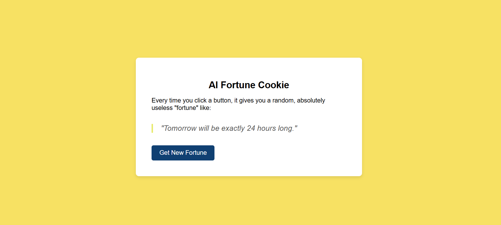
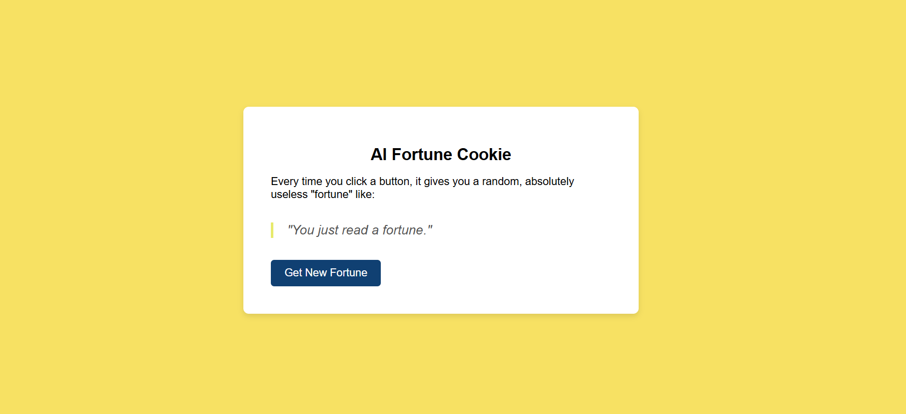
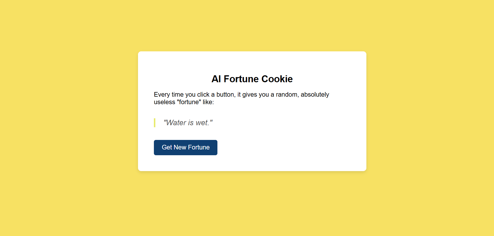

# fortune-cookie 🎯


## Basic Details
### Team Name: uselessteam


### Team Members
- Team Lead: Anupama M V- Thejus Engineering College 
- Member 2: Angel Mariya- Thejus Engineering College 


### Project Description
A fun web app that gives you random, silly, and sometimes absurd “fortunes” every time you click a button .

### The Problem (that doesn't exist)
Life is too predictable… you never get enough ridiculous predictions from inanimate cookies.

### The Solution (that nobody asked for)
An AI-powered fortune cookie that serves absolutely useless but hilarious fortunes to brighten your day.

## Technical Details
### Technologies/Components Used
For Software:
-Languages:HTML, CSS, JavaScript, Python
-Framework: Flask
-Libraries: requests, gunicorn
-Tools:Render for hosting


### Implementation

# Installation
#### 1. Clone the repository 
```bash
git clone https://github.com/anu291/fortune-cookie-web.git
cd fortune-cookie

#### 2. Create and activate a virtual environment

```bash
# Create the environment
python -m venv venv

# Activate on Windows
venv\Scripts\activate

# Activate on macOS/Linux
source venv/bin/activate
```
#### 3. Install dependencies

```bash
pip install -r requirements.txt
```
### Run the Application

```bash
python app.py
```

**Open the application in your browser:**

``` bash
http://127.0.0.1:5000
```


# Screenshots (Add at least 3)

The main interface of the AI Fortune Cookie app with the title, a fun background, and the “Get New Fortune” button in the center. This is where users start.


"After clicking the button, the app displays a unique fortune message generated by the AI. In this example, the fortune says: "Tomorrow will be exactly 24 hours long." The fortune appears instantly below the button, making the experience quick and fun."



A second click generates a completely different fortune, showing the variety and humor of the web’s outputs.


## Team Contributions
-Team Lead: Anupama M V- Thejus Engineering College 
- Member 2: Angel Mariya- Thejus Engineering College 

---
Made with ❤️ at TinkerHub Useless Projects 


